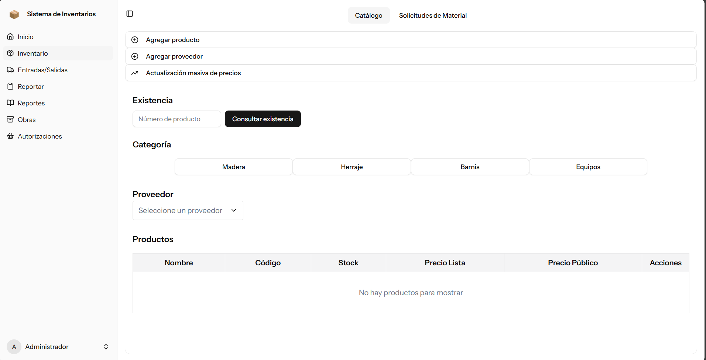
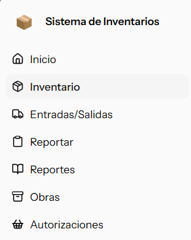

# Inventory Management System

**Scalable inventory & project tracking web app**



A full-featured inventory management system built with Laravel Framework and a React + TypeScript frontend (Laravel React starter kit). The app supports receipts, shipments, stock movements, project allocations, file attachments, and role-based access control (Spatie). The UI uses shadcn for component primitives and follows a component-driven architecture for maintainability.

---

## Demo

Live demo: **

Repository: *[SISTEMA_INVENTARIOS](https://github.com/Gerts18/SISTEMA_INVENTARIOS)*

---

## Key features

* Product receipts and shipments tracking
* Project-based inventory tracking
* Role-based access control (Spatie Permissions) with Administrator / Design / Warehouse / Checker / Production
* File uploads and asset management via AWS S3 (Project Documents and Material Requests)
* Responsive UI built with shadcn and TypeScript

---

## Tech stack

* Backend: Laravel (API)
* Frontend: React + TypeScript, Web Router, shadcn UI components
* Auth & RBAC: Spatie Permissions
* Storage: AWS S3 for file assets

---

## Architecture overview

* **API (Laravel)**: exposes REST endpoints for products, stock movements, projects, users, and file uploads. Business logic lives in services and domain models; long-running work is offloaded to queues.
* **Frontend (React + TS)**: component-driven UI that consumes the API, enforces client-side validation and handles optimistic UI updates where appropriate.
* **Storage**: files stored on S3; signed URLs used for secure temporary access.
* **Permissions**: Spatie manages roles and permissions enforced server-side; UI adapts per-role to hide/disable actions.

---

## Workflow (step-by-step purpose of each section)

This section explains the purpose and typical actions in each major area of the system so non-technical stakeholders can understand how the application supports operations.



### 1. Home / Inicio

**Purpose:** Give the user a welcome message and let him know what role has been assigned to.
**Who uses it:** Everyone.

### 2. Inventory Catalog / Inventario 

**Purpose:** Create, display and edit products, add suppliers (proveedores) and increase price of products. Also if you have a Warehouse rol, you can see Material requests. If you are Design you can make a material request. 
**Who uses it:** Warehouse can do all the actions specified before, this section is also available for Design and Checker roles, but they can only see the catalog of products.  

### 3. Receipts and Shipments / Entradas y Salidas

**Purpose:** Record incoming stock into the system.
**Who uses it:** Warehouse role is the only one with access to this section, here you can edit the stock of the products created, but you need to add a receipt to secure a good track of materials. 

### 4. Report / Reportar

**Purpose:** Report daily progress of each project. 
**Who uses it:** Everyone. You can describe what your progress was and in witch project you did it. 

### 5. Reports / Reportes

**Purpose:** Keep track of dailiy reports and receipts and shipments of products.
**Who uses it:** Administrator and Checker roles have access to this part, his main porpouse is have a record when someone makes a daily report or a warehouse user edits the stock of a product.

### 6. Projects / Obras

**Purpose:** Create and manage projects. 
**Who uses it:** Administrator and Design have access to it, Design is the one on charge of creating projects, you can add a description an attach a file. Also, every Material request related to a project is goint to appear
there. You can add records of everything you need. 

### 7. Authoriations / Autorizaciones

**Purpose:** Authorize activities, bidgets and anything needed.
**Who uses it:** Design and Warehouse roles can request authorizations, and the Administrator is the one who authorizes it. 

---

## Getting started (local development)

### Prerequisites

* PHP 8.x, Composer
* Node.js 16+ and npm/yarn
* Postgres
* AWS credentials (for S3) or configure local filesystem for development

### Environment variables

Create a `.env` at the project root:

```env
APP_NAME=Inventario
APP_ENV=local
APP_KEY=base64:...
APP_URL=localhost

DB_CONNECTION=psql
DB_HOST=localhost
DB_PORT=5432
DB_DATABASE=inventory_dev
DB_USERNAME=root
DB_PASSWORD=

AWS_ACCESS_KEY_ID=your_key
AWS_SECRET_ACCESS_KEY=your_secret
AWS_DEFAULT_REGION=your-region
AWS_BUCKET=your-bucket
AWS_USE_PATH_STYLE_ENDPOINT=false
AWS_URL="https://{bucket-name}.s3.{region}.amazonaws.com/"

```

### Install and run

```bash
# Install PHP deps
composer install

# Install node deps
npm install

# Migrate and seed
php artisan migrate --seed

# Start dev server
composer run dev
```
---


## Contact

German Torres — [germants180@gmail.com](mailto:germants180@gmail.com)
Andre Becerra — [germants180@gmail.com](mailto:)

